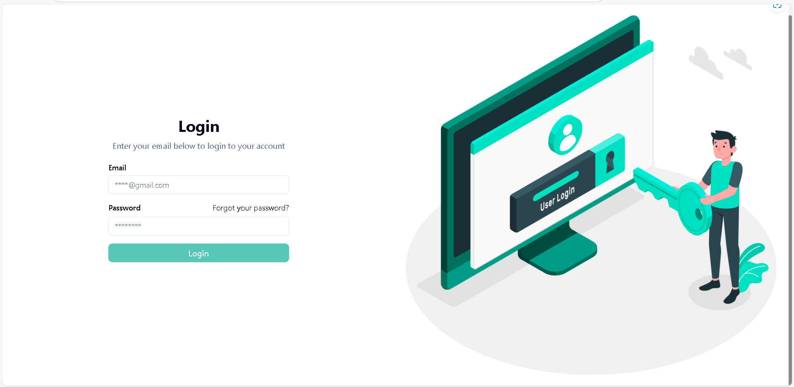
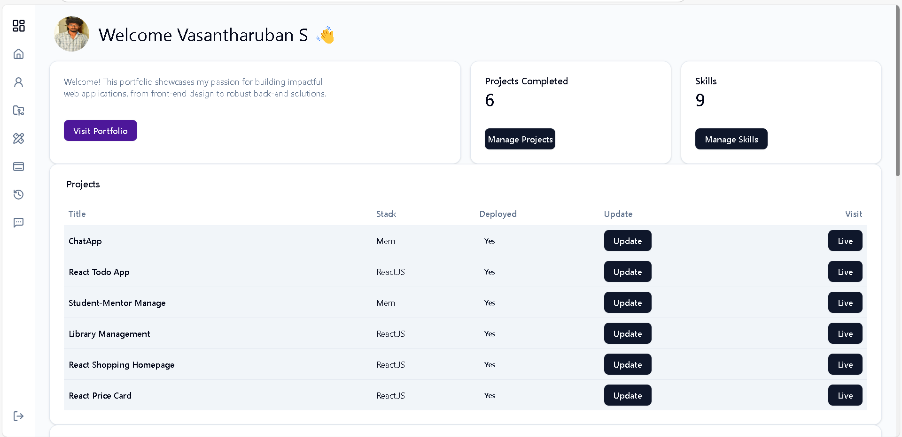
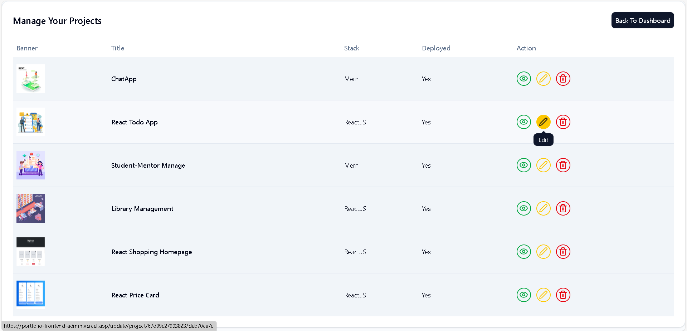

# 🚀 MERN Portfolio Admin Panel (Full Stack)

The **MERN Portfolio Admin Panel** is a web-based application that enables users to manage their portfolio dynamically. It provides an **admin dashboard** for adding, updating, and deleting profile, myapps, skills, timeline, skills , and projects with a secure authentication system.

This project is built using **MongoDB, Express.js, React.js, and Node.js (MERN Stack)**, with Redux Toolkit for state management and authentication powered by JWT.

---

## 🔥 **Key Features**

✅ **Admin Dashboard** – Manage portfolio content easily  
✅ **CRUD Operations** – Add, edit, delete projects, blogs, testimonials, and skills  
✅ **Authentication** – Secure login system using JWT (JSON Web Tokens)  
✅ **Role-Based Access Control (RBAC)** – Restricts access to authorized users only  
✅ **Responsive UI** – Mobile-friendly with Tailwind CSS  
✅ **Redux Toolkit** – Efficient state management  
✅ **Backend with Express & MongoDB** – Handles API requests and database operations  
✅ **File Upload Support** – Allows profile & project images to be uploaded  
✅ **Error Handling** – Robust error management on both frontend & backend  
✅ **Deployement** – **Frontend on Vercel**, **Backend on Render**  

---

## 🛠️ **Tech Stack**

| Technology        | Usage                                |
|------------------|-----------------------------------|
| **MongoDB**      | NoSQL Database                     |
| **Express.js**   | Backend API Framework             |
| **React.js**     | Frontend UI                        |
| **Node.js**      | Backend Runtime                   |
| **Redux Toolkit** | Global State Management          |
| **Tailwind CSS**  | Styling & Layout Optimization    |
| **JWT Authentication** | Secure Login System        |
| **Mongoose**     | MongoDB Object Modeling           |
| **Axios**        | API Requests Handling            |
| **Formik & Yup** | Form Handling & Validation       |
| **React Router** | Client-Side Navigation           |
| **Cloudinary / Multer** | File Upload Handling      |
| **Vercel**       | Frontend Deployment               |
| **Render**       | Backend Deployment               |

---

## 📸 Screenshots

